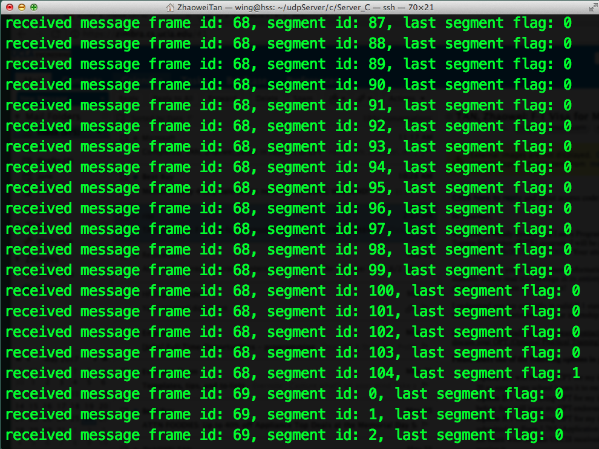
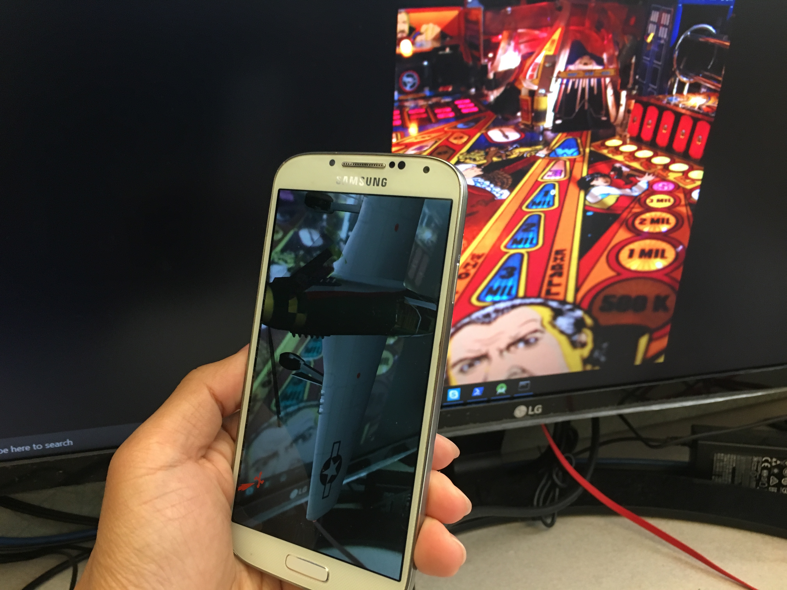
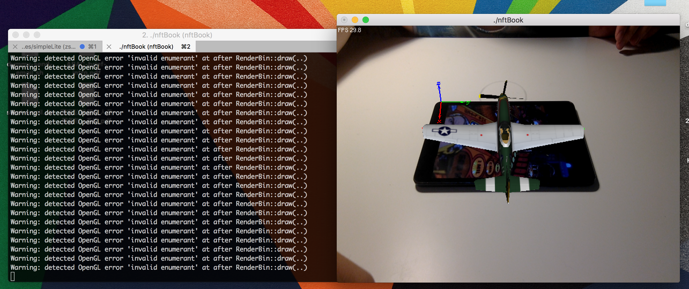

Checkpoint Report for CS 219
============================

**Team**: Yuanzhi Gao (704145326), Zhaowei Tan (504777867), Zheng Xing (504013807), Zhiyi Zhang (104705108)

**Project**: Cloud-Assisted Augmented Reality (AR) on Android

Current Progress
--------

**Source Code**:
* Server: https://github.com/Zhiyi-Zhang/nftBook-server
* Socket: https://github.com/ZhaoweiTan/nftBook-socket
* Android: https://github.com/gaoyuanzhi/nftbook-client

### Realized video upstream and downstream between android endpoint and remote server ###
We have implemented the video stream transfer between two endpoints using UDP. The client (Android smartphone) could initiate an AR session with server, by sending the message in pre-defined format to finish the initialization. Upon receiving the message, the server side acknowledges this packet, and then opens and listens to various ports, which receive different type of messages from the client, as we will introduce later.

When the client detects that the server is running, it collects data locally, and sends them through the socket to the server. The stream data includes the video frames captured by the camera, along with the sensor information harnessed by the built-in Android sensors. Each type is sent to a different socket in the server side, and the edge server is able to process different kind of information to execute further tasks.  

Below is a snapshot of server's receiving UDP packets. The UDP payload is 1100 Bytes. You could find the detailed implementation in our github repos.



### Designed the video frame transfer protocol based on UDP ###
Each packet size in a stream is bounded by the path MTU, we segment our video frame before they are transported to the Internet. Given the receiving application should be aware of the boundary of each while being able to check whether the frame is integrated, the pure UDP is not sufficient.
Therefore, we designed a video transfer protocol in which we add:
  * Packet type (through port number):
    + Initialization metadata
    + Video Frame Data
    + Sensor Data
  * Frame identifier (2 bytes)
  * Frame segmentation identifier (1 byte)
  * FIN flag (1 byte)

Below is a snippet of code where the server reads the header of an incoming video frame and extracts the information out of it.
```
Language: C
Function: Packet decoding at server

      short* frame_id = (short*)malloc(sizeof(short));
      memcpy(frame_id, buf, 2);
      short* segment_id = (short*)malloc(sizeof(short));
      *segment_id = 0;
      memcpy(frame_id, buf + 2, 1);
      short* last_segment_tag = (short*)malloc(sizeof(short));
      *last_segment_tag = 0;
      memcpy(last_segment_tag, buf + 3, 1);
```

### Realized AR logic on both server side and Android side ###
We successfully modify, compile, and run the ARToolKit applications on multiple platforms. The library provided by ARToolKit is capable of detecting a pre-programmed pattern (a marker in AR jargon), and rendering a new object onto it. These will serve as our final AR applications for demonstration.

AR running on Android endpoint.



AR running on Linux.



By later integrating the local version with the transport function we just realized, we will fulfil the vision where the detection and render are performed at the server after the client provides the video frame remotely.  

### Realized Android sensor information collection and uploading to remote server ###
The sensor information includes:
  * Light Sensor
  * Accelerometer
  * Magnetic Field Sensor
Note that the three sensors integrated belong to environment, motion and position sensors, respectively. More sensors could be added promptly using similar logic.

Core function on Android endpoint

```
Language: Java (in Android)
Function: Collecting ACCELEROMETER sensor info

// Register a sensor
mSensorManager = (SensorManager) getSystemService(Context.SENSOR_SERVICE);
mACC = mSensorManager.getDefaultSensor(Sensor.TYPE_ACCELEROMETER);

// Callback function to collect sensor data
public final void onSensorChanged(SensorEvent event) {
    // The example ACCELEROMETER has three return values
    float x = event.values[0];
    float y = event.values[1];
    float z = event.values[2];

    // put these values in socket
}
```

Technical Issues and Our Plans
------------------------------

### Single video frame grabbed directly from camera is too large ###
We found that a single raw Android video frame is about **100 KB**.
Considering that if MTU = 1000B, it usually needs around **100 UDP packets** to transfer one singe frame, which is not viable at all. The estimated throughput is 50mbps if we set the frame rate as 60fps, which far exceeds the LTE bandwidth and is prohibitively high for future experiment and deployment. 
Ideally, Cloud-Assisted AR requires low latency; the throughput should be small enough to fit the bandwidth in the wild.

Moreover, the increase of UDP packet number also causes higher packet lost possibility for each frame, especially in a long-distance, wireless environment.
Because of the vulnerability that AR processing requires format-strict and size-strict frame data, packet lost means the entire frame would finally be dropped to avoid head-of-line blocking, instead of incurring unacceptable high latency. This means that we shall keep the throughput small to repress the number of the packets.

**Solution:**
Cloud-Assisted AR desires low latency, reasonable throughput, and relatively high reliability. As a result we need to compress our video frames to improve the performance. There are several industry-standardized codecs to dramatically decreases the size of the video stream data. We plan on using Android built-in codecs for encoding and decoding the data harnessed from the camera. 

### Server AR process should take Android endpoint's upload as input ###
Currently we have achieved AR logic on both the sever side and Android endpoint.
However, it is not an easy task to combine these two parts together.
The server (MACOS) and Android endpoint are using totally different parameters regarding the video frame;
they use totally different modules of the AR library to process input video.

**Solution:**
We need to finish the AR logic and complete the logic flow. We are currently adapting the server side code to use the same pre-installed parameter as the Android side.
Further efforts on diving into the library source and figuring out how each parameter works are being taken by the team.

Future work
-----------

* Video stream compression
* Server AR: getting input from Android endpoint
* Android endpoint: drawing the frame downloaded from remote server

Timeline
--------
### **Before Week 9** ###

Solve technical issues mentioned in the report.

### **Week 9** ###

Performance evaluation and improvement.

* Record the RTT of video stream packets without compression
* Compare the RTT change after utilizing compression
* Study the metrics under different wireless technologies (WiFi, LTE)

### **Week 10** ###

Presentation and project report.